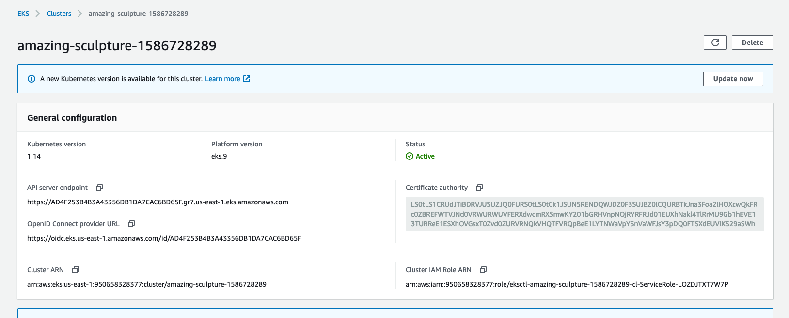
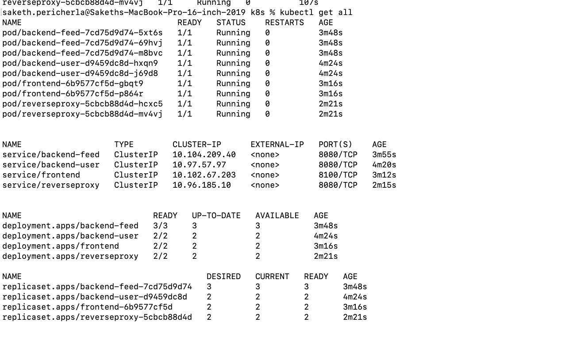
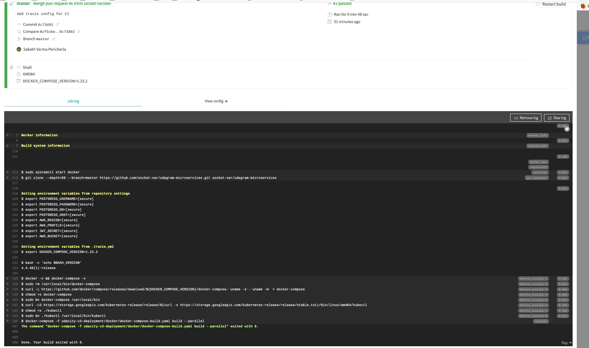

# Udagram microservices:

This project:

- Divides the application into smaller services
- Containerizes the application, create the Kubernetes resource, and deploy it to a Kubernetes cluster.
- Implements automatic continuous integration (CI) and continuous delivery (CD) using Travis CI.
- Extends the application with deployments and be able to do rolling-updates and rollbacks

## Instructions:

- Create aws-secret.yaml, env-secret.yaml and store the appropriate secrets.
- Change the config variables in env-configmap.yaml
- Install eksctl by following instructions from https://docs.aws.amazon.com/eks/latest/userguide/getting-started-eksctl.html
- Follow instructions from the udacity course to deployt to eks using kubectl commands
- Below screenshot shows that the Kubernetes cluster has been successfully created:



- Below is the screenshot obtained by running `% kubectl get all`



- Follow the instructions in the udacity course to add a .travis.yaml file in the root of your project
- Below is the screenshot that shows a successful build with Travis CI on push to Github:



- `kubectl set image` command can be used to initiate a rolling update as follows:

```
% kubectl set image deployments/udacity-restapi-feed udacity-restapi-feed=sakethpericherla/udacity-restapi-feed:v2
```

- Similarly the changes can be rolled back using the undo command as follows:

```
kubectl rollout undo deployments/udacity-restapi-feed
```
